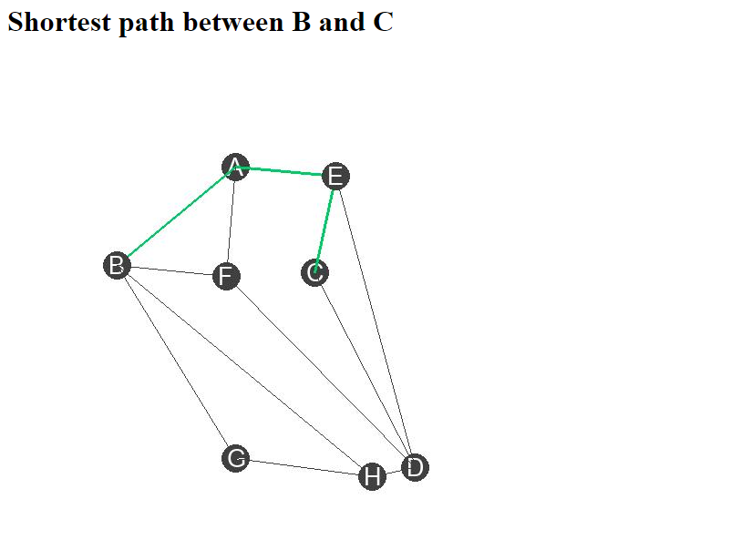

# Dijkstra algorithm for Laravel

[](https://laravel.com/)

[](LICENSE)

A laravel implementation of [Dijkstra algorithm](https://en.wikipedia.org/wiki/Dijkstra%27s_algorithm).

Dijkstra's algorithm, conceived by computer scientist Edsger Dijkstra, is a graph search algorithm that solves in single-source shortest path problem for a graph with non-negative edge path costs, producing a shortest path tree.

## Installation

First you need to add the component to your composer.json

```
composer require noweh/laravel-dijkstra
```

Update your packages with *composer update* or install with *composer install*.

Laravel uses Package Auto-Discovery, so doesn't require you to manually add the ServiceProvider.

### Laravel without auto-discovery

After updating composer, add the ServiceProvider to the providers array in config/app.php

    Noweh\Dijkstra\DijkstraServiceProvider::class,

### Migration

The migrations of this package are publishable under the "migrations" tag via:

    php artisan vendor:publish --provider="Noweh\Dijkstra\DijkstraServiceProvider" --tag="migrations"

## Usage

### Operations with Points and draw graph / find shortest path
```php
    <?php
    
    use Dijkstra;

    /** @var IPointsService $pointsService */
    $pointsService = Dijkstra::pointsService();

    // Create all points
    $pointsService->createStructure([
            ['name' => 'A', 'x' => 250, 'y' => 120],
            ['name' => 'B', 'x' => 120, 'y' => 228],
            // ...
            ['name' => 'H', 'x' => 400, 'y' => 460]
        ], [
            ['A' => 'B'],
            // ...
            ['H' => 'D']
        ]);

    // add One point
    $pointsService->addPoint(['name' => 'I', 'x' => 60, 'y' => 30]);

    // Remove one point
    $pointsService->removePoint('B');

    // Add relation
    $pointsService->addRelation(['E' => 'I']);

    // Remove relation
    $pointsService->removeRelation(['A' => 'B']);

    // Retrieve all points
    dump($pointsService->getPoints());

    /** @var IGraphService $graphService */
    $graphService = Dijkstra::graphService();
    $pointFrom = $pointsService->getPoint('B');
    $pointTo = $pointsService->getPoint('C');
    
    dump($graphService->findShortestPath($pointFrom, $pointTo));
    
    // Draw a Graph
    $graphService->drawGraph($pointFrom, $pointTo);
```
#### Display example with the use of the drawGraph() method

